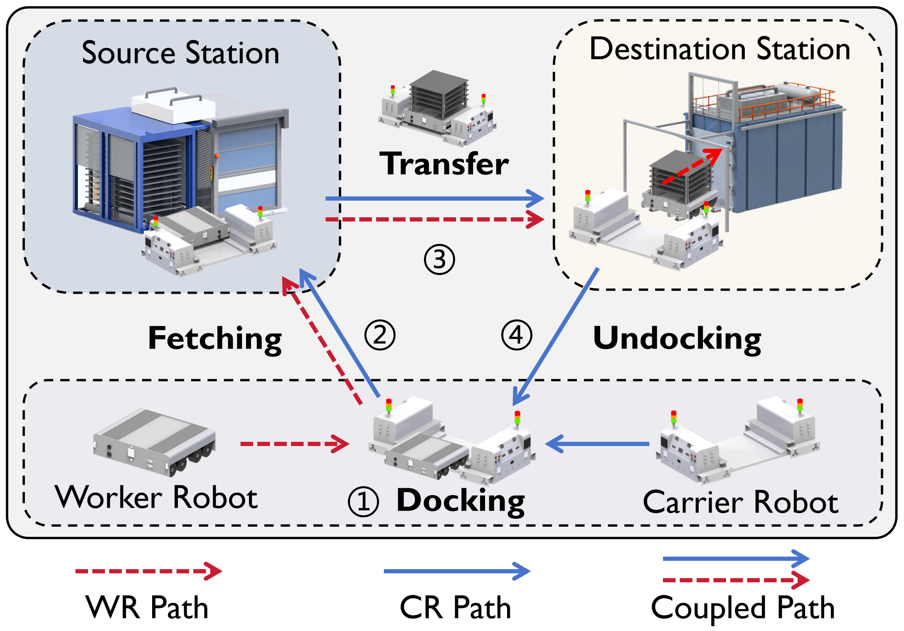
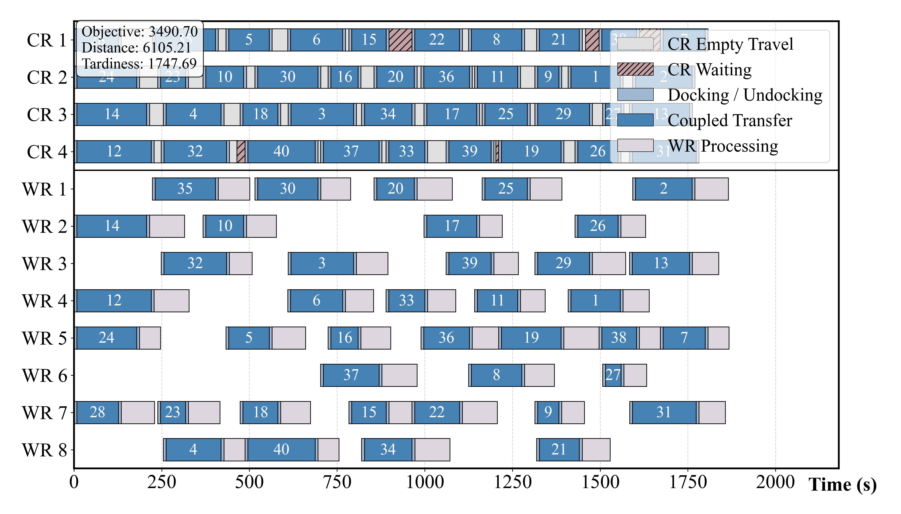
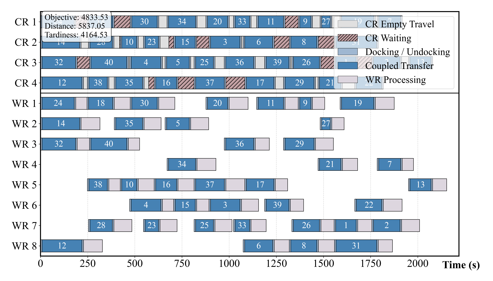
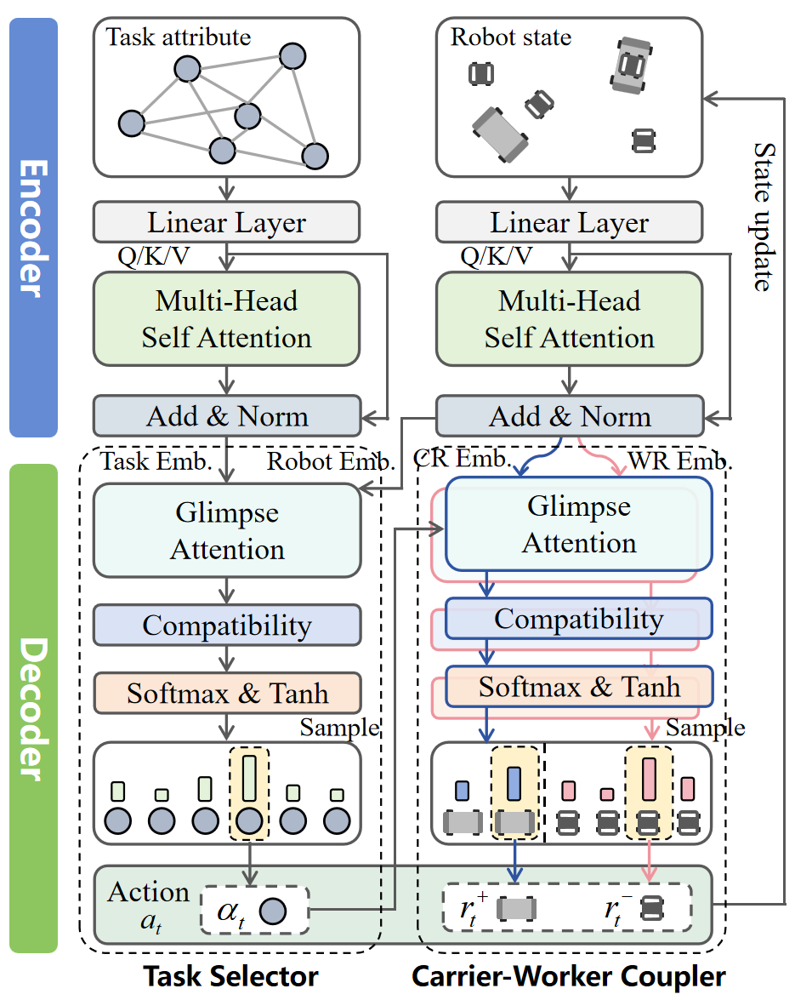

# MaRS-Net: A Transformer-Based Deep Reinforcement Learning for Cooperative Scheduling in Marsupial Robotic Systems

<div align="center">

[](LICENSE)
[](environment.yml)
[](https://pytorch.org/)
[](https://git-lfs.com/)

**Official implementation for "MaRS-Net: A Transformer-Based Deep Reinforcement Learning Approach for Cooperative Scheduling in Marsupial Robotic Systems".**

</div>

---

## 📖 Introduction

**Marsupial Robotic Systems (MRS)** coordinate large mobile carriers with smaller deployable robots. This architecture combines global mobility with specialized local operation, but it also introduces strict physical coupling and synchronization constraints.

This repository provides the revised implementation of **MaRS-Net**, a Transformer-based Deep Reinforcement Learning (DRL) framework for the **Cooperative Marsupial Robot Scheduling Problem (CMRSP)**.

The system contains two heterogeneous robot types:

- **Carrier Robots (CRs):** provide global inter-station transport and carry worker robots between stations.
- **Worker Robots (WRs):** perform local intra-station operations after being deployed at destination stations.

Each task requires a synchronized carrier-worker-task assignment. The collaboration follows a four-stage workflow: **Docking → Fetching → Transfer → Undocking**

<div align="center">
  
  <br>
  <em>Figure 1. Cooperative workflow of carrier and worker robots.</em>
</div>

Figure 1 illustrates the **cooperative workflow of carrier and worker robots**. The **red dashed path** represents the WR trajectory, while the **blue solid path** represents the CR trajectory. Since a WR cannot move between stations independently, it must synchronize with a CR for inter-station transfer. After docking, the red and blue paths overlap as the **coupled path**, indicating that the CR and WR move as a synchronized unit until undocking.

---

## 🎬 Visualization Demo

The repository includes an animation of carrier-worker collaboration in an industrial environment. The video shows how multiple CRs and WRs execute tasks under CMRSP synchronization constraints:

- CRs navigate through main aisles.
- WRs are transported by CRs between stations.
- WRs enter local processing chambers after undocking.
- Multiple carrier-worker pairs operate concurrently while avoiding infeasible task reuse.

https://github.com/user-attachments/assets/928c993c-489d-4d9c-a9ef-b3bca33df0b6

> **Note:** If the video above does not render, please view `media/Carrier_worker_cooperation.mp4` locally.

**Legend:**

- **Source Nodes (Red):** task fetch locations.
- **Destination Nodes (Green):** designated locations for undocking and processing.
- **Processing Chambers (Grey):** areas where WRs operate independently.
- **Aisle (White):** navigable paths for CRs.

Example schedules generated by MaRS-Net and ALNS are also provided:

<div align="center">
  
  
  <br>
  <em>Figure 2. Gantt chart comparison between MaRS-Net and ALNS on a 40-task instance.</em>
</div>

Figure 2 provides a qualitative comparison on a 40-task instance. MaRS-Net obtains a **lower objective value** than ALNS (`3490.70` vs. `4833.53`), mainly due to a substantial reduction in **tardiness** (`1747.69` vs. `4164.53`) while maintaining a comparable carrier travel distance (`6105.21` vs. `5837.05`). The MaRS-Net schedule is more compact, with fewer CR waiting periods and tighter CR-WR synchronization, leading to better workload balance across WRs and reduced idle time under coupling constraints.

---

## ⚙️ MaRS-Net Architecture

MaRS-Net formulates CMRSP as a Markov Decision Process with a composite action space. The policy constructs schedules autoregressively, jointly handling task assignment, carrier-worker coupling, routing, and synchronization.

<div align="center">
  
  <br>
  <em>Figure 3. Policy network architecture of MaRS-Net.</em>
</div>

The framework consists of two main modules:

### 1. Dual-Stream Encoder

- **Task Stream:** encodes static task attributes, including source/destination coordinates, processing time, and deadline, via Multi-Head Self-Attention layers.
- **Robot Stream:** encodes dynamic robot states, including current location and current time. These embeddings are re-computed at each decision step to reflect the real-time fleet status.

### 2. Hierarchical Decoder

The decoder constructs each composite action in two stages:

- **Task Selector:** first identifies an unfinished task to execute.
- **Carrier-Worker Coupler:** conditioned on the selected task, assigns a compatible carrier-worker pair to form a collaborative execution unit.

This hierarchical design allows MaRS-Net to construct synchronized carrier-worker-task decisions while avoiding explicit enumeration of all possible task-carrier-worker combinations.

---

## 🗂️ Repository Layout

```text
MaRS_Net/
  README.md
  environment.yml
  requirements.txt
  Instance/                    # Synthetic and industrial benchmark instances
  media/                       # Figures and videos used in this README
  marsnet/                     # Final MaRS-Net implementation
  baselines/
    drl/
      hdrl/                    # Adapted HDRL baseline
      tdrl/                    # Adapted TDRL baseline
    conventional/              # Gurobi, OR-Tools, ALNS, IGA, DABC, DIWO
  checkpoints/
    marsnet/                   # MaRS-Net checkpoints for n=10,20,30,40,60,100
    hdrl/                      # HDRL checkpoints for n=10,20,30,40,60,100
    tdrl/                      # TDRL checkpoints for n=10,20,30,40,60,100
  scripts/
    train_drl.py               # Unified DRL training entrypoint
    eval_drl.py                # Unified DRL evaluation entrypoint
    run_conventional.py        # Unified conventional baseline runner
    benchmark_all.py           # Batch benchmark script
  docs/
    methods.md                 # Method and adaptation notes
    reproduce.md               # Reproducibility commands
```

---

## 🛠️ Installation

Install Git LFS before cloning or before pulling checkpoints:

```bash
git lfs install
git clone https://github.com/Kemingjun/MaRS_Net.git
cd MaRS_Net
git lfs pull
```

Create the Conda environment:

```bash
conda env create -f environment.yml
conda activate marsnet
```

Alternatively, install dependencies with pip:

```bash
pip install -r requirements.txt
```

Notes:

- **Gurobi** requires a valid local Gurobi license.
- **OR-Tools** is installed through the `ortools` Python package.
- **Checkpoints** are stored with Git LFS.

---

## 💾 Checkpoints

Final `epoch-99.pt` checkpoints are released for MaRS-Net and the adapted DRL baselines:

```text
checkpoints/marsnet/size_{10,20,30,40,60,100}/epoch-99.pt
checkpoints/hdrl/size_{10,20,30,40,60,100}/epoch-99.pt
checkpoints/tdrl/size_{10,20,30,40,60,100}/epoch-99.pt
```

If a `.pt` file appears as a small text pointer instead of a binary checkpoint, run:

```bash
git lfs pull
```

---

## 🚀 Evaluate MaRS-Net

Greedy decoding on the 20-task uniform benchmark:

```bash
python scripts/eval_drl.py \
  --method marsnet \
  --dataset Instance/uniform_100_per_scale_20260413/size_20_uniform \
  --model checkpoints/marsnet/size_20 \
  --decode_strategy greedy \
  --eval_batch_size 1
```

Sampling with 1280 candidate solutions:

```bash
python scripts/eval_drl.py \
  --method marsnet \
  --dataset Instance/uniform_100_per_scale_20260413/size_20_uniform \
  --model checkpoints/marsnet/size_20 \
  --decode_strategy sample \
  --width 1280 \
  --eval_batch_size 1
```

To evaluate another scale, change both the dataset folder and checkpoint folder, for example:

```text
Instance/uniform_100_per_scale_20260413/size_40_uniform
checkpoints/marsnet/size_40
```

---

## 🧪 Evaluate DRL Baselines

HDRL and TDRL are adapted to CMRSP while preserving their original core design principles:

- **HDRL:** preserves vehicle-aware dispatch and route-context-aware decoding.
- **TDRL:** preserves token-style state coding and GRU-based dynamic token updates.
- **CMRSP adaptation:** both baselines are modified with carrier-worker-task assignment, a carrier-worker coupler, and synchronized transition dynamics.

```bash
python scripts/eval_drl.py \
  --method hdrl \
  --dataset Instance/uniform_100_per_scale_20260413/size_20_uniform \
  --model checkpoints/hdrl/size_20 \
  --decode_strategy greedy \
  --eval_batch_size 1

python scripts/eval_drl.py \
  --method tdrl \
  --dataset Instance/uniform_100_per_scale_20260413/size_20_uniform \
  --model checkpoints/tdrl/size_20 \
  --decode_strategy greedy \
  --eval_batch_size 1
```

---

## 🏋️ Train DRL Models

Train MaRS-Net:

```bash
python scripts/train_drl.py --method marsnet --graph_size 20 --run_name marsnet_20
```

Train adapted DRL baselines:

```bash
python scripts/train_drl.py --method hdrl --graph_size 20 --run_name hdrl_20
python scripts/train_drl.py --method tdrl --graph_size 20 --run_name tdrl_20
```

Additional training arguments are forwarded to the method-specific `run.py`. For a lightweight smoke test:

```bash
python scripts/train_drl.py \
  --method marsnet \
  --graph_size 20 \
  --n_epochs 1 \
  --epoch_size 512 \
  --batch_size 128 \
  --run_name smoke_marsnet
```

For larger instances, encoder checkpointing can reduce GPU memory usage:

```bash
python scripts/train_drl.py \
  --method marsnet \
  --graph_size 100 \
  --checkpoint_encoder \
  --run_name marsnet_100
```

---

## 🧩 Run Conventional Baselines

The repository includes exact/constraint-programming baselines and four metaheuristics:

- `gurobi`: Gurobi MIP model.
- `or_tool`: OR-Tools CP-SAT model.
- `ALNS`: Adaptive Large Neighborhood Search.
- `IGA`: Iterated Greedy Algorithm.
- `DABC`: Discrete Artificial Bee Colony.
- `DIWO`: Discrete Invasive Weed Optimization.

Run OR-Tools:

```bash
python scripts/run_conventional.py \
  --solver or_tool \
  --instance Instance/uniform_100_per_scale_20260413/size_10_uniform/T10_I1_uniform.xlsx \
  --time_limit 60
```

Run ALNS:

```bash
python scripts/run_conventional.py \
  --solver ALNS \
  --instance Instance/uniform_100_per_scale_20260413/size_10_uniform/T10_I1_uniform.xlsx \
  --max_iterations 100 \
  --seed 1234
```

The same interface supports `gurobi`, `IGA`, `DABC`, and `DIWO`.

---

## 📊 Batch Benchmark

Run a batch benchmark over MaRS-Net and DRL baselines:

```bash
python scripts/benchmark_all.py \
  --dataset Instance/uniform_100_per_scale_20260413/size_20_uniform \
  --methods marsnet hdrl tdrl \
  --decode_strategies greedy sample \
  --sample_width 1280 \
  --eval_batch_size 1 \
  --out_prefix final_size20_uniform
```

The script writes:

```text
final_size20_uniform.csv
final_size20_uniform.md
```

---

## ✅ Reproducibility Checks

Compile all Python sources:

```bash
python -m compileall marsnet baselines scripts
```

Run a minimal MaRS-Net checkpoint loading test:

```bash
python scripts/eval_drl.py \
  --method marsnet \
  --dataset Instance/uniform_100_per_scale_20260413/size_20_uniform \
  --model checkpoints/marsnet/size_20 \
  --decode_strategy greedy \
  --eval_batch_size 1 \
  --val_size 1 \
  --no_cuda
```

More commands are provided in [docs/reproduce.md](docs/reproduce.md).

---

## 📌 Citation

If you use this repository, please cite the MaRS-Net paper after publication. A BibTeX entry will be added when the final bibliographic information is available.

## License

This project is released under the [MIT License](LICENSE).
