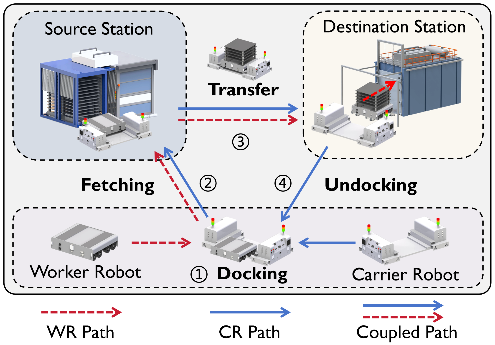
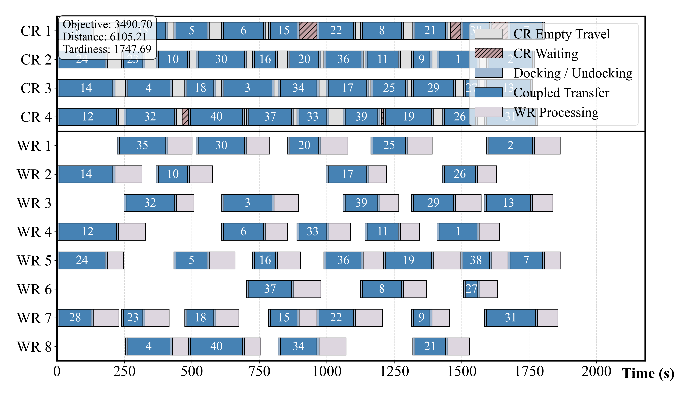
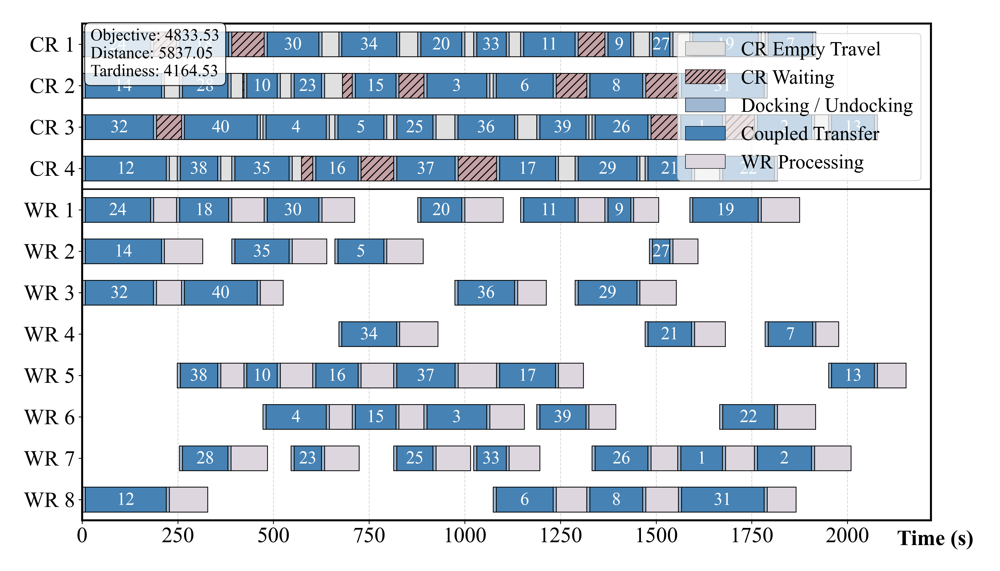
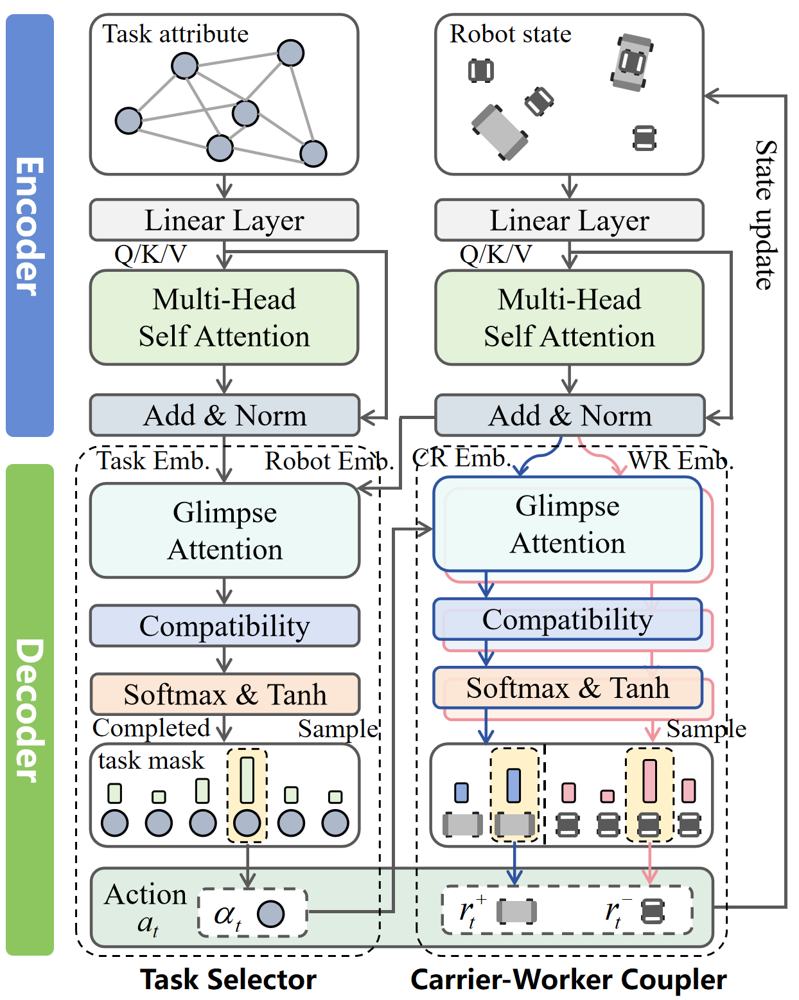

# Collaborative Carrier–Worker Scheduling in Marsupial Robotic Systems via Deep Reinforcement Learning

<div align="center">

[](LICENSE)
[](environment.yml)
[](https://pytorch.org/)
[](https://git-lfs.com/)

**MaRS-Net implementation accompanying the ICRA 2027 submission.**

</div>

---

## 📖 Introduction

**Marsupial Robotic Systems (MRS)** coordinate large mobile carriers with smaller deployable robots. This architecture combines global mobility with specialized local operation, but it also introduces strict physical coupling and synchronization constraints.

This repository provides **MaRS-Net**, a constructive Deep Reinforcement Learning (DRL) policy for the **Collaborative Carrier–Worker Scheduling Problem (CCWSP)**. A structured Markov Decision Process (MDP) represents each action as a task and a complete carrier–worker pair. Its state transitions maintain spatial and temporal consistency during sequential schedule construction.

The system contains two heterogeneous robot types:

- **Carrier Robots (CRs):** provide global inter-station transport and carry worker robots between stations.
- **Worker Robots (WRs):** perform local intra-station operations after being deployed at destination stations.

Each task requires a synchronized carrier-worker-task assignment. The collaboration follows a four-stage workflow: **Docking → Fetching → Transfer → Undocking**

<div align="center">
  
  <br>
  <em>Figure 1. Cooperative workflow of carrier and worker robots.</em>
</div>

Figure 1 illustrates the **cooperative workflow of carrier and worker robots**. The **red dashed path** represents the WR trajectory, while the **blue solid path** represents the CR trajectory. Since a WR cannot move between stations independently, it must synchronize with a CR for inter-station transfer. After docking, the red and blue paths overlap as the **coupled path**, indicating that the CR and WR move as a synchronized unit until undocking.

---

## 🎬 Webots Simulation Demo

The Webots video illustrates the carrier–worker task-execution workflow in an industrial environment under CCWSP synchronization constraints:

- CRs navigate through main aisles.
- WRs dock with CRs for inter-station transport.
- CR-WR coupled units move synchronously before undocking.
- WRs enter local processing chambers after being released at destination stations.

<div align="center">
  <video src="media/Webots_carrier_worker_cooperation.mp4" controls muted width="70%"></video>
  <br>
  <em>Video 1. Webots demonstration of the collaborative carrier–worker workflow.</em>
</div>

> **Note:** If the embedded video does not render, open `Webots_carrier_worker_cooperation.mp4` from the repository's `media/` folder. This release contains the demonstration recording; Webots world files and controllers are not included. The demonstration illustrates the execution workflow and does not establish deployment-level closed-loop performance.

**Legend:**

- **Source Nodes (Red):** task fetch locations.
- **Destination Nodes (Green):** designated locations for undocking and processing.
- **Processing Chambers (Grey):** areas where WRs operate independently.
- **Aisle (White):** navigable paths for CRs.

An additional single-instance scheduling example is provided below. It is separate from the aggregate benchmark tables in the manuscript:

<div align="center">
  
  
  <br>
  <em>Figure 2. Gantt chart comparison between MaRS-Net and ALNS on a 40-task instance.</em>
</div>

Figure 2 illustrates carrier and worker activity for one 40-task instance. The charts can be used to inspect **task sequencing, synchronization waiting, and worker processing periods**. These illustrations are not an aggregate performance comparison; the instance and execution traces supporting this example are not packaged with this release.

---

## ⚙️ MaRS-Net Architecture

MaRS-Net learns a policy over the structured MDP for CCWSP. Each composite action selects an unscheduled task and assigns a carrier–worker pair; the resulting action sequence induces the robot routes. The deterministic transition updates robot availability and task tardiness under the modeled synchronization constraints.

<div align="center">
  
  <br>
  <em>Figure 3. Policy network architecture of MaRS-Net.</em>
</div>

The framework consists of two main modules:

### 1. Dual-Stream Encoder

- **Task Stream:** encodes static task attributes, including source/destination coordinates, processing time, and deadline, via Multi-Head Self-Attention layers.
- **Robot Stream:** encodes the location and **availability time** of each robot after its already scheduled operations. These embeddings are recomputed at each construction step.

### 2. Hierarchical Decoder

The decoder constructs each composite action in two stages:

- **Task Selector:** first selects an unscheduled task, with already scheduled tasks excluded by a hard mask.
- **Carrier-Worker Coupler:** conditioned on the selected task, assigns a compatible carrier-worker pair to form a collaborative execution unit.

This hierarchical design allows MaRS-Net to construct synchronized carrier-worker-task decisions while avoiding explicit enumeration of all possible task-carrier-worker combinations.

---

## 🗂️ Repository Layout

```text
MaRS-Net/
  README.md
  environment.yml
  requirements.txt
  Instance/                    # Synthetic and industrial benchmark instances
  media/                       # Figures and videos used in this README
  marsnet/                     # Final MaRS-Net implementation
  baselines/
    drl/
      hdrl/                    # Adapted HDRL baseline
      tdrl/                    # Adapted TDRL baseline
    conventional/              # Gurobi, OR-Tools, ALNS, IGA, DABC, DIWO
  checkpoints/
    marsnet/                   # MaRS-Net checkpoints for n=10,20,30,40,60,100
    hdrl/                      # HDRL checkpoints for n=10,20,30,40,60,100
    tdrl/                      # TDRL checkpoints for n=10,20,30,40,60,100
  scripts/
    train_drl.py               # Unified DRL training entrypoint
    eval_drl.py                # Unified DRL evaluation entrypoint
    run_conventional.py        # Unified conventional baseline runner
    benchmark_all.py           # Batch benchmark script
  docs/
    methods.md                 # Method and adaptation notes
    metaheuristic_baselines.md # Metaheuristic parameters and operators
    reproduce.md               # Reproducibility commands
```

---

## 🛠️ Installation

Download the repository using **Full repo ZIP** on the anonymous repository page, extract the archive, and open a terminal in the directory containing this README.

Create the Conda environment:

```bash
conda env create -f environment.yml
conda activate marsnet
```

Alternatively, install dependencies with pip:

```bash
pip install -r requirements.txt
```

Notes:

- **Gurobi** requires a valid local Gurobi license.
- **OR-Tools** is installed through the `ortools` Python package.
- **Checkpoints** use Git LFS in the source repository. An anonymous archive must contain the actual checkpoint binaries to support evaluation; a Git LFS pointer alone is insufficient.

---

## 💾 Checkpoints

Final `epoch-99.pt` checkpoints are released for MaRS-Net and the adapted DRL baselines:

```text
checkpoints/marsnet/size_{10,20,30,40,60,100}/epoch-99.pt
checkpoints/hdrl/size_{10,20,30,40,60,100}/epoch-99.pt
checkpoints/tdrl/size_{10,20,30,40,60,100}/epoch-99.pt
```

The released synthetic dataset contains `n={10,20,40,60,100}` instances, while the industrial dataset contains `n={10,20,30,40}` instances.

Training configurations are stored in `args.json` alongside each checkpoint.

---

## 🚀 Evaluate MaRS-Net

Greedy decoding on the 20-task uniform benchmark:

```bash
python scripts/eval_drl.py \
  --method marsnet \
  --dataset Synthetic_Dataset \
  --model checkpoints/marsnet/size_20 \
  --decode_strategy greedy \
  --eval_batch_size 1
```

Sampling with 1280 candidate solutions:

```bash
python scripts/eval_drl.py \
  --method marsnet \
  --dataset Synthetic_Dataset \
  --model checkpoints/marsnet/size_20 \
  --decode_strategy sample \
  --width 1280 \
  --eval_batch_size 1
```

To evaluate another scale, change the checkpoint folder. The dataset family is resolved automatically from the checkpoint size:

```text
Synthetic_Dataset
checkpoints/marsnet/size_40
```

---

## 🧪 Evaluate DRL Baselines

HDRL and TDRL are adapted to CCWSP while preserving their original core design principles:

- **HDRL:** preserves vehicle-aware dispatch and route-context-aware decoding.
- **TDRL:** preserves token-style state coding and GRU-based dynamic token updates.
- **CCWSP adaptation:** both baselines use carrier-worker-task assignment, a carrier-worker coupler, and synchronized transition dynamics.

```bash
python scripts/eval_drl.py \
  --method hdrl \
  --dataset Synthetic_Dataset \
  --model checkpoints/hdrl/size_20 \
  --decode_strategy greedy \
  --eval_batch_size 1

python scripts/eval_drl.py \
  --method tdrl \
  --dataset Synthetic_Dataset \
  --model checkpoints/tdrl/size_20 \
  --decode_strategy greedy \
  --eval_batch_size 1
```

---

## 🏋️ Train DRL Models

Example: train MaRS-Net with the implementation defaults:

```bash
python scripts/train_drl.py --method marsnet --graph_size 20 --run_name marsnet_20
```

Train adapted DRL baselines:

```bash
python scripts/train_drl.py --method hdrl --graph_size 20 --run_name hdrl_20
python scripts/train_drl.py --method tdrl --graph_size 20 --run_name tdrl_20
```

Additional training arguments are forwarded to the method-specific `run.py`. For a lightweight smoke test:

```bash
python scripts/train_drl.py \
  --method marsnet \
  --graph_size 20 \
  --n_epochs 1 \
  --epoch_size 512 \
  --batch_size 128 \
  --run_name smoke_marsnet
```

For larger instances, encoder checkpointing can reduce GPU memory usage:

```bash
python scripts/train_drl.py \
  --method marsnet \
  --graph_size 100 \
  --checkpoint_encoder \
  --run_name marsnet_100
```

---

## 🧩 Run Conventional Baselines

The repository includes exact/constraint-programming baselines and four metaheuristics:

- `gurobi`: Gurobi MIP model.
- `or_tool`: OR-Tools CP-SAT model.
- `ALNS`: Adaptive Large Neighborhood Search.
- `IGA`: Iterated Greedy Algorithm.
- `DABC`: Discrete Artificial Bee Colony.
- `DIWO`: Discrete Invasive Weed Optimization.

Run OR-Tools:

```bash
python scripts/run_conventional.py \
  --solver or_tool \
  --instance Synthetic_Dataset/size_10_uniform/T10_I1_uniform.xlsx \
  --time_limit 60
```

Run ALNS:

```bash
python scripts/run_conventional.py \
  --solver ALNS \
  --instance Synthetic_Dataset/size_10_uniform/T10_I1_uniform.xlsx \
  --max_iterations 100 \
  --seed 1234
```

The same interface supports `gurobi`, `IGA`, `DABC`, and `DIWO`.

Metaheuristic parameter settings and operator details are documented in [docs/metaheuristic_baselines.md](docs/metaheuristic_baselines.md).

---

## 📊 Batch Benchmark

Run a batch benchmark over MaRS-Net and DRL baselines:

```bash
python scripts/benchmark_all.py \
  --dataset Synthetic_Dataset \
  --methods marsnet hdrl tdrl \
  --decode_strategies greedy sample \
  --sample_width 1280 \
  --eval_batch_size 1 \
  --sizes 10 20 40 60 100 \
  --out_prefix final_synthetic
```

The script writes:

```text
final_synthetic.csv
final_synthetic.md
```

---

## ✅ Reproducibility Checks

Compile all Python sources:

```bash
python -m compileall marsnet baselines scripts
```

Run a minimal MaRS-Net checkpoint loading test:

```bash
python scripts/eval_drl.py \
  --method marsnet \
  --dataset Instance/Synthetic_Dataset/size_20_uniform/T20_I1_uniform.xlsx \
  --model checkpoints/marsnet/size_20 \
  --decode_strategy greedy \
  --eval_batch_size 1 \
  --no_cuda
```

More training and evaluation commands, including cross-scale examples, are provided in [docs/reproduce.md](docs/reproduce.md).

---

## 📌 Citation

If you use this repository, please cite the MaRS-Net paper after publication. A BibTeX entry will be added when the final bibliographic information is available.

## License

This project is released under the [MIT License](LICENSE).
